# 🎯 Claude Dev Kit - AI-Native Development Toolkit

[](https://github.com/kyuwon-shim-ARL/claude-dev-kit/releases)
[](https://github.com/kyuwon-shim-ARL/claude-dev-kit/blob/main/.github/workflows/tadd-enforcement.yml)
[](LICENSE)

**프롬프트 기반 개발과 엔터프라이즈 CI/CD를 완벽하게 통합한 AI-Native 개발 도구**

## 🚀 핵심 혁신: TADD Enforcement System (v24)

### 진정한 Test-AI-Driven Development

```mermaid
graph LR
    A[프롬프트] --> B[테스트 생성]
    B --> C[GitHub Actions]
    C --> D[강제 검증]
    D --> E[PR 차단/승인]
```


- **시스템적 강제**: AI도 회피 불가능한 품질 보증
- **자동 검증**: 테스트-코드 순서, Mock 사용률, 커버리지
- **즉각 피드백**: PR 코멘트로 상세 가이드 제공

## ⚡ 30초 설치

```bash
# Universal 설치 (Git 유무 자동 감지)
curl -sSL https://raw.githubusercontent.com/kyuwon-shim-ARL/claude-dev-kit/main/init.sh | bash

# 또는 직접 다운로드
wget https://raw.githubusercontent.com/kyuwon-shim-ARL/claude-dev-kit/main/init.sh
chmod +x init.sh
./init.sh "프로젝트명" "프로젝트 설명"
```

## 🎯 TADD 로컬 검증

```bash
# 빠른 검증 (추천)
./scripts/quick_tadd_check.sh

# 상세 분석
python scripts/verify_tadd_order.py   # 테스트-코드 순서
python scripts/detect_mock_usage.py   # Mock 사용률 분석
```

## 🤖 슬래시 명령어 (v24 기준)

### 핵심 워크플로우
| 명령어 | 설명 | TADD 통합 |
|--------|------|-----------|
| `/기획` | 구조화된 탐색-계획 루프 | PRD 기반 테스트 시나리오 |
| `/구현` | DRY 원칙 구현 | **테스트 먼저 작성 강제** |
| `/안정화` | 구조적 지속가능성 | Mock < 20% 검증 |
| `/배포` | 자동 배포 + 검증 | 품질 게이트 통과 필수 |

### 통합 명령어
- `/전체사이클`: 기획→구현→안정화→배포 (TADD 전 과정)
- `/개발완료`: 구현→안정화→배포
- `/품질보증`: 안정화→배포

### 보조 도구
- `/주간보고`: Git 기반 성과 측정
- `/레포정리`: 구조/코드/문서 종합 정리
- `/문서정리`: 프로젝트 문서 아카이빙

## 📊 GitHub Actions 자동 강제

### PR 머지 전 필수 체크
```yaml
✅ Test-First Development   # 테스트가 먼저 작성되었는가?
✅ Mock Usage < 20%         # 실제 테스트인가?
✅ Coverage >= 80%          # 충분한 커버리지인가?
✅ All Tests Pass           # 모든 테스트 통과했는가?
```

### 실패 시 자동 피드백
```markdown
❌ TADD Violation Detected

Tests must be written before implementation.
Current mock usage: 45% (limit: 20%)

Please fix and resubmit.
```

## 🏗️ 프로젝트 구조

```
claude-dev-kit/
├── .github/
│   └── workflows/
│       └── tadd-enforcement.yml    # TADD 강제 CI/CD
├── scripts/
│   ├── verify_tadd_order.py        # 순서 검증
│   ├── detect_mock_usage.py        # Mock 분석
│   └── quick_tadd_check.sh         # 빠른 검증
├── .claude/
│   └── commands/                   # 슬래시 명령어
├── docs/
│   ├── CURRENT/                    # 현재 작업
│   ├── guides/                     # 개발 가이드
│   └── templates/                  # 문서 템플릿
├── init.sh                         # Universal 설치
├── CLAUDE.md                       # 프로젝트 문서
└── README.md                       # 이 파일
```

## 📈 성과 지표

### Before (프롬프트만)
- TADD 준수: 30%
- Mock 남발: 무제한
- 회귀 테스트: 없음
- AI 회피: 가능

### After (시스템 강제)
- TADD 준수: **100%**
- Mock 제한: **20% 이하**
- 회귀 테스트: **모든 PR**
- AI 회피: **불가능**

## 🔥 주요 기능

### 1. TADD Enforcement (v24)
- Git 히스토리 기반 순서 검증
- AST 분석으로 Mock 패턴 검출
- PR 자동 차단/승인
- 상세 피드백 제공

### 2. 슬래시 명령어 시스템
- 4단계 개발 워크플로우
- 프롬프트 템플릿 제공
- 자동 문서화
- Git 통합

### 3. 시간 추적 (v18)
- 자동 Git 감지
- 변경 이력 추적
- 성능 분석
- 월별 리포트

### 4. 문서 관리 (ZEDS 3.0)
- 자동 동기화
- 구조적 정리
- 버전 관리
- 아카이빙

## 🚀 Quick Start Guide

### 1. 새 프로젝트 시작
```bash
mkdir my-project && cd my-project
./init.sh "my-project" "AI-powered application"
```

### 2. 개발 사이클
```bash
# 기획
/기획 "사용자 인증 시스템"

# 구현 (TADD 자동 적용)
/구현 "로그인 기능"
# → 테스트 먼저 생성
# → CI 실패 확인
# → 구현 코드 작성
# → CI 성공 확인

# 검증
./scripts/quick_tadd_check.sh

# 배포
/배포
```

### 3. PR 생성
```bash
git checkout -b feature/login
git add .
git commit -m "test: Add login tests"
git commit -m "feat: Implement login"
git push origin feature/login
# → GitHub Actions 자동 검증
# → TADD 통과 시 머지 가능
```

## 📚 문서

- [CLAUDE.md](CLAUDE.md) - 프로젝트 상세 문서
- [설치 가이드](docs/guides/installation.md)
- [TADD 가이드](docs/guides/tadd-guide.md)
- [슬래시 명령어](docs/guides/slash-commands.md)
- [CI/CD 설정](docs/guides/cicd-setup.md)

## 🤝 기여하기

1. Fork the repository
2. Create feature branch (`git checkout -b feature/amazing`)
3. **Write tests first** (`test: Add amazing tests`)
4. Implement feature (`feat: Add amazing feature`)
5. Run TADD check (`./scripts/quick_tadd_check.sh`)
6. Create Pull Request

## 📊 프로젝트 상태

- **현재 버전**: v24.0.0
- **최신 기능**: TADD Enforcement System
- **테스트 커버리지**: 목표 80%
- **Mock 사용률**: 제한 20%
- **CI/CD**: GitHub Actions

## 🛠️ 기술 스택

- **Languages**: Python, Bash, YAML
- **CI/CD**: GitHub Actions
- **Testing**: pytest, AST analysis
- **Documentation**: Markdown, ZEDS 3.0
- **Version Control**: Git, Semantic Versioning

## 📝 라이선스

MIT License - 자유롭게 사용, 수정, 배포 가능

## 🔗 링크

- [GitHub Repository](https://github.com/kyuwon-shim-ARL/claude-dev-kit)
- [Releases](https://github.com/kyuwon-shim-ARL/claude-dev-kit/releases)
- [Issues](https://github.com/kyuwon-shim-ARL/claude-dev-kit/issues)
- [Discussions](https://github.com/kyuwon-shim-ARL/claude-dev-kit/discussions)

## 🙏 감사의 말

이 프로젝트는 Claude와의 협업으로 만들어졌습니다.
AI-Native 개발의 미래를 함께 만들어가는 모든 개발자분들께 감사드립니다.

---

**"프롬프트는 권고, 시스템은 강제"** - TADD가 진정한 품질을 보증합니다.

Made with ❤️ by [Claude Dev Kit Team](https://github.com/kyuwon-shim-ARL)