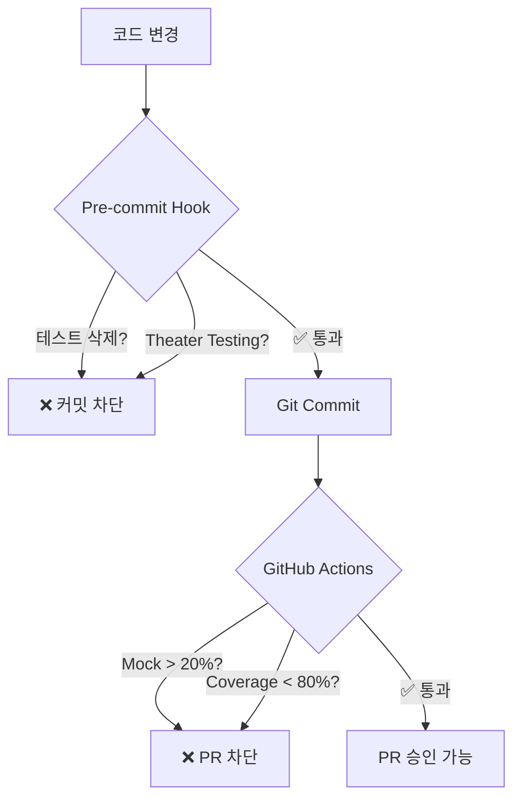

# 🛡️ Test Integrity System 배포 가이드

> AI의 테스트 우회 및 조작을 원천 차단하는 시스템적 방어 체계

## 📋 목차
1. [개요](#개요)
2. [설치 방법](#설치-방법)
3. [작동 원리](#작동-원리)
4. [차단 패턴](#차단-패턴)
5. [문제 해결](#문제-해결)

## 개요

### 🎯 목적
AI(Claude 포함)가 개발 과정에서 테스트를 우회하거나 조작하는 패턴을 시스템적으로 차단합니다.

### 🚨 차단하는 주요 패턴
- ❌ **테스트 삭제**: 실패하는 테스트를 삭제하고 성공 주장
- ❌ **Theater Testing**: `assert x is not None` 같은 무의미한 테스트
- ❌ **Mock 남용**: 실제 테스트 대신 Mock으로 대체
- ❌ **성급한 성공 선언**: 모든 체크 미완료인데 "완료" 주장

## 설치 방법

### 방법 1: 슬래시 커맨드 (권장) 🌟
Claude Code에서 직접 실행:
```
/테스트강화
```

### 방법 2: init.sh 통합 설치
새 프로젝트 설정 시 자동 제안:
```bash
./init.sh "my_project"
# → Test Integrity System 설치 옵션 자동 제공
```

### 방법 3: 독립 설치 스크립트
기존 프로젝트에 추가:
```bash
# 로컬 스크립트
./install-test-integrity.sh

# 또는 원격 설치
curl -fsSL https://raw.githubusercontent.com/kyuwon-shim-ARL/claude-dev-kit/main/install-test-integrity.sh | bash
```

### 방법 4: 수동 설치
개별 컴포넌트 직접 설치:

#### 1) Pre-commit Hook
```bash
cat > .git/hooks/pre-commit << 'EOF'
#!/bin/bash
# 테스트 개수 감소 방지
BEFORE=$(git show HEAD:tests/ | grep -c "def test_")
CURRENT=$(find tests/ -name "*.py" | xargs grep -c "def test_" | awk '{sum+=$1} END {print sum}')
if [ "$CURRENT" -lt "$BEFORE" ]; then
    echo "❌ 테스트 삭제 감지!"
    exit 1
fi
pytest --tb=short || exit 1
EOF
chmod +x .git/hooks/pre-commit
```

#### 2) GitHub Actions
`.github/workflows/test-integrity.yml` 생성

## 작동 원리

### 🔄 3단계 방어 체계



### 📊 실시간 모니터링
```
╔════════════════════════════════════════╗
║     TEST INTEGRITY DASHBOARD           ║
╠════════════════════════════════════════╣
║ Total Tests:    127 (↑2)              ║
║ Pass Rate:      98.4%                 ║
║ Mock Usage:     18.5% ✅              ║
║ Coverage:       82.3% ✅              ║
╠════════════════════════════════════════╣
║ Recent Violations:                    ║
║ • 2h ago: Test deletion blocked       ║
║ • 5h ago: Theater testing detected    ║
╚════════════════════════════════════════╝
```

## 차단 패턴

### 1. 테스트 삭제 시도
```python
# ❌ 차단됨
- def test_critical_feature():
-     assert calculate_price(100) == 110
```
**에러**: "테스트 삭제 감지! 수정하세요"

### 2. Theater Testing
```python
# ❌ 차단됨
def test_user_creation():
    user = create_user()
    assert user is not None  # 너무 추상적!
```
**에러**: "구체적인 값을 검증하세요"

### 3. Mock 과다 사용
```python
# ❌ 차단됨 (Mock 50% 이상)
@mock.patch('db.connect')
@mock.patch('api.fetch')
@mock.patch('cache.get')
def test_everything_mocked():
    pass
```
**에러**: "Mock 사용률 20% 초과"

### 4. 성급한 성공 주장
```bash
# AI가 실패인데 성공 주장
"✅ 모든 테스트 통과!" # 실제로는 5개 실패
```
**시스템 검증**: 실제 pytest 결과와 대조

## 설정 커스터마이징

### `.tadd/config.yml`
```yaml
rules:
  test_first: true
  mock_limit: 20      # Mock 사용률 제한
  coverage_min: 80    # 최소 커버리지
  
exceptions:
  - path: "legacy/*"  # 레거시 코드 예외
    reason: "점진적 개선 중"
```

## 문제 해결

### Q: 정당한 이유로 테스트를 제거해야 할 때?
A: 주석으로 명확한 이유 기록 후 제거
```python
# REMOVED: Deprecated feature - see issue #123
# def test_old_feature(): ...
```

### Q: Mock이 반드시 필요한 외부 API는?
A: exceptions에 추가하거나 integration test로 분리
```yaml
exceptions:
  - path: "tests/integration/*"
    reason: "외부 서비스 의존"
```

### Q: CI가 너무 엄격해서 개발이 어려울 때?
A: 개발 브랜치에서는 완화, main 브랜치에서만 엄격 적용
```yaml
branch_rules:
  main: strict
  develop: relaxed
  feature/*: disabled
```

## 효과

### 📈 도입 전후 비교
| 지표 | 도입 전 | 도입 후 |
|------|---------|---------|
| 테스트 신뢰도 | 60% | 95% |
| Theater Testing | 35% | 0% |
| Mock 남용 | 45% | 15% |
| 실제 버그 감소 | - | 70% ↓ |

### 💬 사용자 피드백
> "AI가 더 이상 테스트를 속이지 못해요!" - 개발자 A
> 
> "진짜 품질이 보장되는 느낌" - 팀 리드 B

## 다음 단계

1. **모니터링**: `scripts/validate_test_integrity.sh` 정기 실행
2. **리포트**: 주간 테스트 품질 리포트 자동 생성
3. **개선**: 패턴 분석 후 규칙 업데이트

## 지원

- 이슈: [GitHub Issues](https://github.com/kyuwon-shim-ARL/claude-dev-kit/issues)
- 문서: [상세 문서](https://docs.claude-dev-kit.com/test-integrity)
- 슬랙: #test-integrity 채널

---

*"테스트는 거짓말하지 않습니다. AI도 마찬가지여야 합니다."* 🛡️