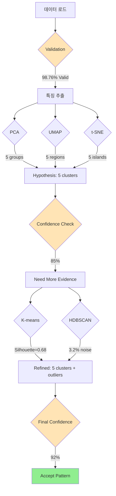

# PRD: /탐구 커맨드 v1.0

> **마이그레이션 노트**: 이 문서는 2025-09-13에 simple_smiles_PCA 프로젝트에서 claude-dev-kit으로 이전되었습니다.
> - 원본 위치: `docs/specs/PRD-explore-command-v1.0.md`
> - 새 위치: `docs/specs/PRD-explore-utilities-v1.0.md`
> - 핵심 기능은 `scripts/explore_utilities.py`에 구현됨

## Transparent Convergence-Driven Exploration System

## 🎯 Product Vision

**"결과뿐만 아니라 사고 과정을 투명하게 공유하는 탐구 도구"**

데이터에서 패턴을 발견하는 과정을 투명하게 보여주고, AI가 어떤 기준으로 어떻게 수렴했는지 모든 과정을 추적 가능하게 만드는 시스템

---

## 💡 핵심 차별화: "투명한 수렴 과정"

### 기존 연구 도구의 한계
- **Black Box**: 결과만 보여주고 과정은 숨김
- **수동 해석**: 연구자가 패턴을 직접 찾아야 함
- **재현 불가**: 어떤 기준으로 결론에 도달했는지 불명확

### `/탐구`의 혁신
- **Glass Box**: 모든 처리 과정이 투명하게 공개
- **AI 자동 수렴**: 패턴을 AI가 발견하고 기준 제시
- **완전 재현**: 모든 단계와 기준이 기록되어 재현 가능

---

## 🔍 수렴 과정의 투명성 설계

### 1. 탐색 단계 (Exploration Phase)
```python
{
    "exploration": {
        "modules_executed": [
            {
                "name": "validation",
                "input": "10,000 SMILES",
                "output": "9,876 valid",
                "decision": "Proceed with 98.76% valid data",
                "criteria": "Validation rate > 95%"
            },
            {
                "name": "feature_extraction", 
                "methods_tried": ["Morgan", "MACCS", "RDKit"],
                "selected": "Morgan + MACCS",
                "reason": "Best balance of speed and information content"
            }
        ]
    }
}
```

### 2. 수렴 기준 (Convergence Criteria)
```python
{
    "convergence_criteria": {
        "pattern_detection": {
            "method": "statistical_significance",
            "threshold": "p < 0.05",
            "confidence": "95%"
        },
        "cluster_validation": {
            "silhouette_score": "> 0.6",
            "davies_bouldin": "< 1.0",
            "consensus": "3/3 methods agree"
        },
        "decision_tree": [
            "IF silhouette > 0.6 AND consensus >= 2/3 THEN accept",
            "ELIF manual_review_flag THEN request_human_input",
            "ELSE continue_exploration"
        ]
    }
}
```

### 3. 수렴 과정 (Convergence Process)
```python
{
    "convergence_process": {
        "iteration_1": {
            "hypothesis": "5 distinct clusters exist",
            "evidence": {
                "pca": "5 separated groups",
                "umap": "5 dense regions",
                "tsne": "5 isolated islands"
            },
            "confidence": 0.85,
            "decision": "Continue for higher confidence"
        },
        "iteration_2": {
            "refined_hypothesis": "5 main clusters + 3% outliers",
            "additional_evidence": {
                "kmeans": "5 clusters, silhouette=0.68",
                "hdbscan": "5 clusters + 321 noise points"
            },
            "confidence": 0.92,
            "decision": "Accept with high confidence"
        },
        "final_conclusion": {
            "pattern": "5 distinct chemical families",
            "outliers": "3.2% rare compounds",
            "reasoning_chain": [
                "Multiple algorithms agree",
                "Statistical significance achieved",
                "Chemical interpretation valid"
            ]
        }
    }
}
```

---

## 📈 보고서 구조: 과정 중심 설계

### 전통적 보고서 (Result-Focused)
```
1. 결과 요약
2. 시각화
3. 결론
```

### `/탐구` 보고서 (Process-Focused)
```
1. 탐색 경로 (Exploration Path)
   - 시도한 모든 방법
   - 각 방법의 결과
   - 선택/배제 기준

2. 수렴 과정 (Convergence Journey)
   - 초기 가설
   - 증거 수집
   - 기준 적용
   - 의사결정 트리

3. 최종 결과 (Final Results)
   - 발견된 패턴
   - 신뢰도 점수
   - 재현 가능한 단계

4. 투명성 메타데이터 (Transparency Metadata)
   - 모든 파라미터
   - 사용된 알고리즘
   - 결정 기준
   - 재현 스크립트
```

---

## 🌈 시각화 예시: 수렴 과정 투명화

### 수렴 과정 다이어그램


### 신뢰도 진행 차트
```python
confidence_progression = {
    "steps": [
        {"stage": "Initial", "confidence": 0.0, "evidence": []},
        {"stage": "PCA", "confidence": 0.3, "evidence": ["Linear separation"]},
        {"stage": "UMAP", "confidence": 0.5, "evidence": ["+ Manifold structure"]},
        {"stage": "t-SNE", "confidence": 0.7, "evidence": ["+ Local clusters"]},
        {"stage": "K-means", "confidence": 0.85, "evidence": ["+ Quantitative validation"]},
        {"stage": "HDBSCAN", "confidence": 0.92, "evidence": ["+ Density confirmation"]},
        {"stage": "Final", "confidence": 0.92, "evidence": ["Consensus achieved"]}
    ]
}
```

---

## 🛠️ 기술적 구현

### 핵심 컴포넌트
```python
class TransparentExploration:
    def __init__(self):
        self.exploration_log = []  # 모든 시도 기록
        self.decision_tree = []     # 모든 결정 기록
        self.convergence_criteria = {}  # 명시적 기준
        
    def explore(self, data, options):
        # 1. 모든 시도를 기록
        for module in self.modules:
            attempt = {
                "module": module.name,
                "input": data,
                "parameters": module.params,
                "timestamp": now(),
                "reason": module.why_trying
            }
            result = module.run(data)
            attempt["output"] = result
            attempt["decision"] = self.evaluate(result)
            self.exploration_log.append(attempt)
            
        # 2. 수렴 기준 적용
        convergence = self.check_convergence()
        
        # 3. 투명한 보고서 생성
        return self.generate_transparent_report()
    
    def check_convergence(self):
        """
        모든 수렴 로직을 투명하게 기록
        """
        decision_path = []
        
        for criterion in self.convergence_criteria:
            check = {
                "criterion": criterion.name,
                "threshold": criterion.threshold,
                "actual_value": self.calculate(criterion),
                "passed": self.evaluate(criterion),
                "reasoning": criterion.explanation
            }
            decision_path.append(check)
            
        self.decision_tree.append({
            "iteration": self.current_iteration,
            "decisions": decision_path,
            "conclusion": self.make_decision(decision_path)
        })
        
        return self.is_converged()
```

---

## 📊 성공 지표

### 투명성 지표
- **과정 추적성**: 100% 모든 단계 기록
- **기준 명시성**: 모든 결정에 기준 포함
- **재현 가능성**: 동일 데이터로 100% 재현
- **설명 가능성**: 모든 결정에 이유 포함

### 품질 지표
- **수렴 시간**: < 60초 (10K 데이터)
- **신뢰도**: > 90% (최종 결론)
- **사용자 이해도**: 비전문가도 과정 이해

---

## 🌐 사용 예시

### 기본 사용
```bash
# 프로젝트 시작
/탐구 init "SMILES Exploration"

# 데이터 로드 및 탐색
/탐구 load compounds.csv
# → 자동: 데이터 품질 평가, 초기 탐색, 과정 기록

# 모듈 실행
/탐구 run all --transparent
# → 모든 처리 과정이 투명하게 기록됨

# 수렴 실행
/탐구 converge --show-criteria
# → 수렴 기준과 과정을 모두 표시

# 보고서 확인
/탐구 report --focus process
# → 과정 중심 보고서 생성
```

### 투명성 강조 옵션
```bash
# 의사결정 트리 표시
/탐구 show decision-tree

# 수렴 기준 확인
/탐구 show convergence-criteria

# 재현 스크립트 생성
/탐구 export --reproducible
```

---

## 🏆 기대 효과

### 연구자에게
- **신뢰성**: AI의 결정을 이해하고 검증 가능
- **학습**: 수렴 과정을 보며 통찰력 향상
- **재현성**: 모든 연구를 100% 재현 가능

### 팀에게
- **협업**: 의사결정 과정 공유로 팀 합의 용이
- **감사**: 모든 과정이 기록되어 감사 가능
- **교육**: 주니어 멤버도 과정 이해 가능

---

## ✅ 결론

**`/탐구`는 단순히 결과를 보여주는 것이 아니라, 그 결과에 도달하는 모든 과정과 기준을 투명하게 공개하는 도구입니다.**

핵심 가치:
1. **투명성**: 모든 과정이 추적 가능
2. **설명성**: 모든 결정에 이유 포함
3. **재현성**: 100% 재현 가능한 연구

---

*"Show the Journey, Not Just the Destination"* 🔍