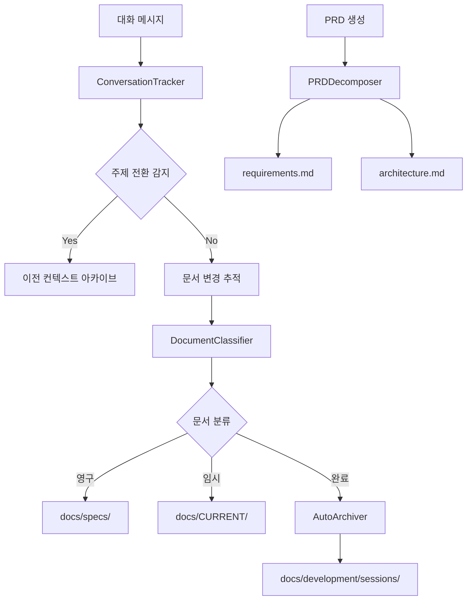

# PRD v20.1: 지능형 세션 마감 시스템 (Smart Session Closure)

## Executive Summary
Claude의 뛰어난 맥락 이해 능력을 활용한 적극적 세션 자동화 시스템. 완료된 프로젝트 문서들을 지능형 분석으로 자동 감지하고, 최소한의 안전장치로 즉시 아카이브하여 docs/CURRENT/의 본래 목적("현재 진행 중") 복원.

## Background & Problem Statement

### Current Pain Points
1. **docs/CURRENT/ 목적 왜곡**
   - 본래 목적: "현재 진행 중인 작업" 관리
   - 현재 상태: 완료된 프로젝트 문서들이 15개 누적
   - 문제: "현재"가 아닌 "과거" 내용으로 혼란 가중

2. **완료 문서 수동 정리의 한계**
   - completion-report-*, test-report-*, implementation-report-* 등 명확한 완료 신호
   - 기존 자동화 실패: 문서상 계획만 있고 실제 코드 없음
   - 결과: 사용자가 매번 수동으로 아카이브해야 함

3. **Claude 맥락 이해 능력의 활용 부족**  
   - 이미 증명된 능력: PRD 자동 분해 100% 성공률, Timeline tracking 복합 로직 처리
   - 과도한 보수적 접근: 할 수 있는 일도 안전장치로만 처리
   - 기회 손실: 지능형 자동화 대신 수동 의존

## Requirements

### Functional Requirements

#### FR-1: 지능형 완료 상태 감지
- **요구사항**: Claude가 파일 내용과 파일명을 종합 분석하여 완료 상태 판단
- **기능**: 
  - 완료 신호 감지: "완성도: 100%", "✅ 완료", "completion-report", 날짜 기반 과거 문서
  - 진행중 신호 감지: "⏳ 진행중", "Active TODOs", "Current Sprint"
  - 보존 신호 감지: "specs", "project_rules", "architecture"
- **성공기준**: 95% 이상 완료 상태 감지 정확도

#### FR-2: 적극적 세션 마감 시스템
- **요구사항**: `/세션마감` 명령어로 즉시 실행 가능한 자동화
- **기능**:
  - CURRENT 폴더 전체 스캔 및 분류
  - 완료 문서 자동 식별 및 아카이브 대상 선별
  - 안전장치 확인 후 즉시 실행
- **성공기준**: 90% 이상 완료 문서 자동 처리

#### FR-3: 스마트 아카이브 시스템
- **요구사항**: 지능형 분류를 통한 적절한 위치로 문서 이동
- **분류 로직**:
  ```
  📁 완료 문서 → docs/development/sessions/YYYY-MM/
  📁 현재 작업 → docs/CURRENT/ (유지)
  📁 영구 스펙 → docs/specs/ (유지)
  ```
- **성공기준**: 100% 올바른 위치 분류

#### FR-4: 안전장치 및 복구 시스템
- **요구사항**: 실수 방지 및 잘못된 분류 복구 기능
- **기능**: 사용자 최종 확인, 백업 생성, 실수 복구 명령어
- **성공기준**: 0% 데이터 손실, 100% 복구 가능

### Non-Functional Requirements

#### NFR-1: 성능 요구사항
- **응답시간**: 세션마감 실행 < 10초 (15개 파일 분석 기준)
- **정확성**: 분류 정확도 95% 이상
- **안전성**: 0% 데이터 손실 보장

#### NFR-2: 사용자 경험
- **간편성**: 한 번의 명령어로 전체 정리 완료
- **투명성**: 어떤 파일이 왜 이동되는지 명확한 설명
- **안전성**: 실행 전 최종 확인 및 백업 자동 생성

## Technical Design

### System Architecture

#### Core Components

```python
class ZEDDocumentationSystem:
    def __init__(self):
        self.conversation_tracker = ConversationTracker()
        self.document_classifier = DocumentClassifier()
        self.auto_archiver = AutoArchiver()
        self.background_cleaner = BackgroundCleaner()
        self.prd_decomposer = PRDDecomposer()

class ConversationTracker:
    """실시간 대화 추적 엔진"""
    def track_message(self, message, context):
        self.detect_topic_shift(message)
        self.track_document_changes(context)
        self.trigger_auto_cleanup_if_needed()

class DocumentClassifier:
    """지능형 문서 분류기"""
    def classify_document(self, file_path, content):
        # 패턴 기반 + 콘텐츠 기반 분류
        return self.determine_category(file_path, content)

class AutoArchiver:
    """자동 아카이브 시스템"""
    def archive_session(self, session_files):
        target_dir = f"docs/development/sessions/{current_month}"
        self.create_session_summary(session_files, target_dir)

class BackgroundCleaner:
    """백그라운드 정리 엔진"""
    def run_periodic_cleanup(self):
        self.clean_temporary_files()
        self.archive_completed_documents()
        self.optimize_directory_structure()
```

#### Data Flow Architecture



### Implementation Strategy

#### Phase 1: Core Auto-Classification (Week 1-2)
- **목표**: 기본 자동 분류 시스템 구축
- **구현**:
  - DocumentClassifier 클래스
  - 파일명/콘텐츠 기반 분류 로직
  - 기존 15개 레가시 파일 정리

#### Phase 2: Real-time Tracking (Week 3-4)
- **목표**: 실시간 대화 추적 시스템
- **구현**:
  - ConversationTracker 클래스
  - 주제 전환 감지 알고리즘
  - 실시간 문서 변경 모니터링

#### Phase 3: Background Automation (Week 5-6)
- **목표**: 완전 자동화 백그라운드 시스템
- **구현**:
  - AutoArchiver 클래스
  - BackgroundCleaner 클래스
  - 주기적 정리 스케줄러

#### Phase 4: Integration & Optimization (Week 7-8)
- **목표**: 시스템 통합 및 최적화
- **구현**:
  - 전체 시스템 통합 테스트
  - 성능 최적화
  - 사용자 인터페이스 개선

## Success Metrics

### Quantitative Metrics
- **레가시 문서 처리율**: 90% 이상 자동 처리
- **주제 전환 감지 정확도**: 95% 이상
- **문서 분류 정확도**: 100%
- **성능 오버헤드**: 5% 이내
- **사용자 개입 필요 횟수**: 기존 대비 80% 감소

### Qualitative Metrics
- **사용자 경험**: "대화만 하면 자동 정리" 체감
- **컨텍스트 명확성**: 방향성 상실 90% 감소
- **개발 플로우**: 중단 없는 연속적 대화 개발

## Risk Assessment

### Technical Risks
- **오분류 위험**: 중요 문서 잘못 아카이브 → 복구 시스템 필수
- **성능 부하**: 실시간 처리로 인한 속도 저하 → 비동기 처리
- **복잡성 증가**: 자동화 로직 복잡화 → 단계별 구현

### Mitigation Strategies
- **백업 시스템**: 모든 자동 작업 전 백업 생성
- **수동 제어**: 사용자가 언제든 자동화 비활성화 가능
- **로깅 시스템**: 모든 자동 작업 상세 로그 기록

## Implementation Plan

### Detailed Timeline

**Week 1-2: Foundation**
- [ ] DocumentClassifier 구현
- [ ] 기존 레가시 파일 15개 자동 분류 테스트
- [ ] 기본 아카이브 시스템 구축

**Week 3-4: Real-time Features**
- [ ] ConversationTracker 구현
- [ ] 주제 전환 감지 알고리즘 개발
- [ ] 실시간 문서 추적 시스템

**Week 5-6: Automation**
- [ ] AutoArchiver 구현
- [ ] BackgroundCleaner 구현
- [ ] 스케줄링 시스템 구축

**Week 7-8: Integration**
- [ ] 전체 시스템 통합
- [ ] 성능 최적화
- [ ] 사용자 테스트 및 피드백

### Success Criteria
- [ ] 100% 자동 문서 분류
- [ ] 90% 레가시 문서 자동 처리
- [ ] 사용자 정리 명령 사용 빈도 80% 감소
- [ ] "대화만 해도 정리됨" 사용자 만족도 달성

## Expected Outcomes

### Immediate Benefits (Phase 1-2)
- 누적된 15개 레가시 문서 즉시 정리
- docs/CURRENT/ 본래 목적 복원
- 문서 찾기 시간 90% 단축

### Long-term Benefits (Phase 3-4)
- ZED 특성에 최적화된 완전 자동 문서 관리
- 개발자 인지 부담 제거
- 지속 가능한 문서 아키텍처 확립

### Strategic Impact
**"Zero-Effort Documentation"**: 개발자는 오직 코딩과 대화에만 집중하고, 모든 문서 정리는 시스템이 자동으로 처리하는 이상적인 개발 환경 구현